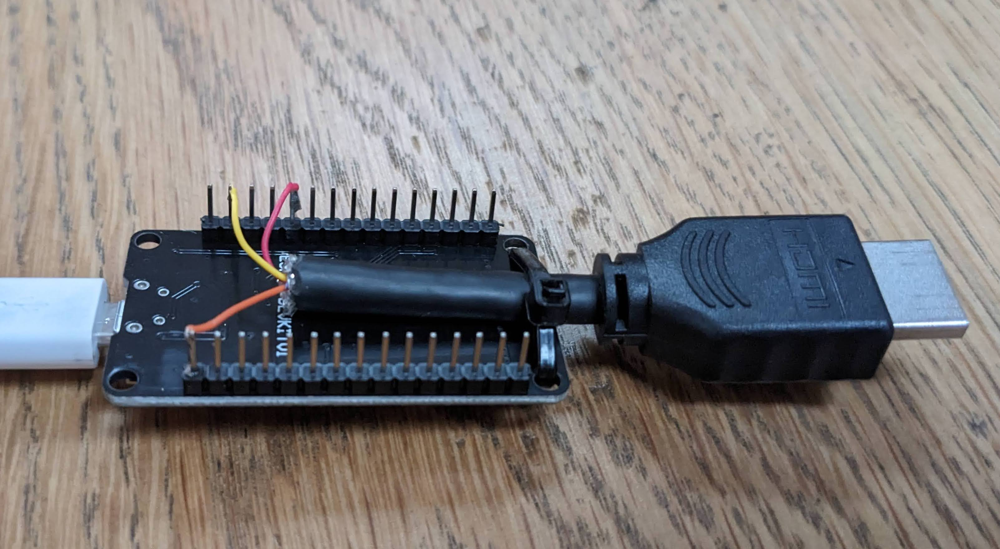

# ScreenTimer

Automatically turn dashboard TVs on during working hours, and off after hours. Uses a ESP32 connected to HDMI-CEC to
control the TV. Needs to connect to Wi-Fi and NTP to get the time.

## Development

    pio run -t uploadfs
    platformio run --target upload
    platformio device monitor

## Update Firmware over Wifi

    platformio run && cp .pio/build/nodemcuv2/firmware.bin ~/Downloads/

Then open http://ScreenTimer.local/update in your browser and upload the firmware.bin file.

